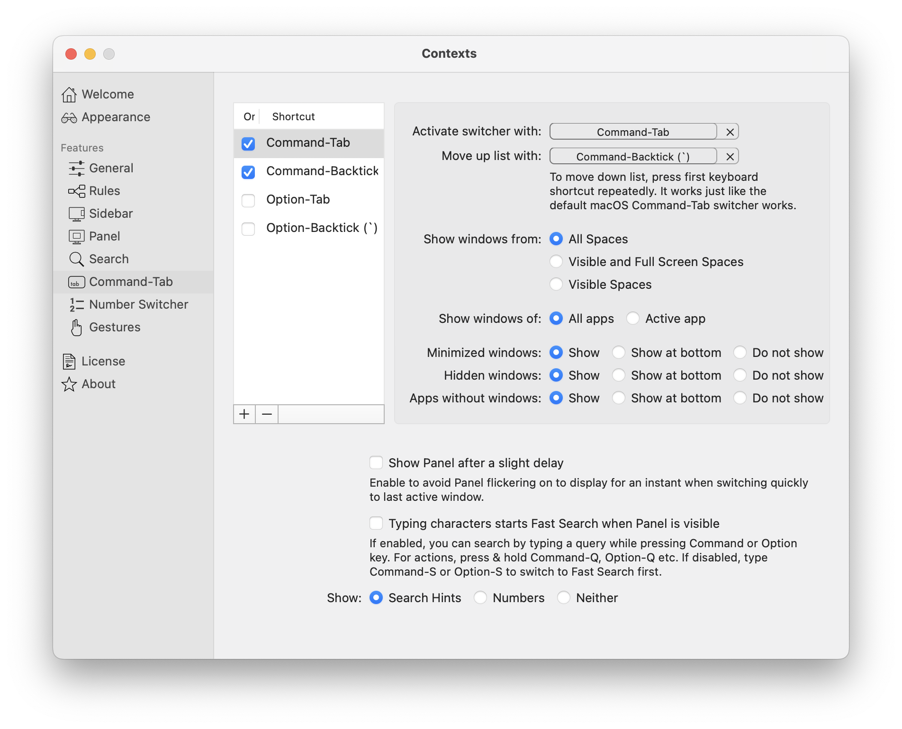
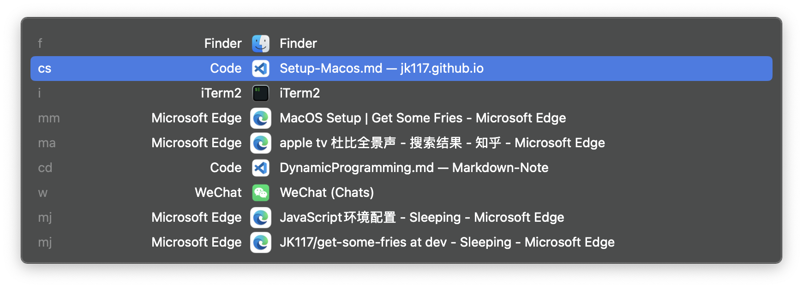
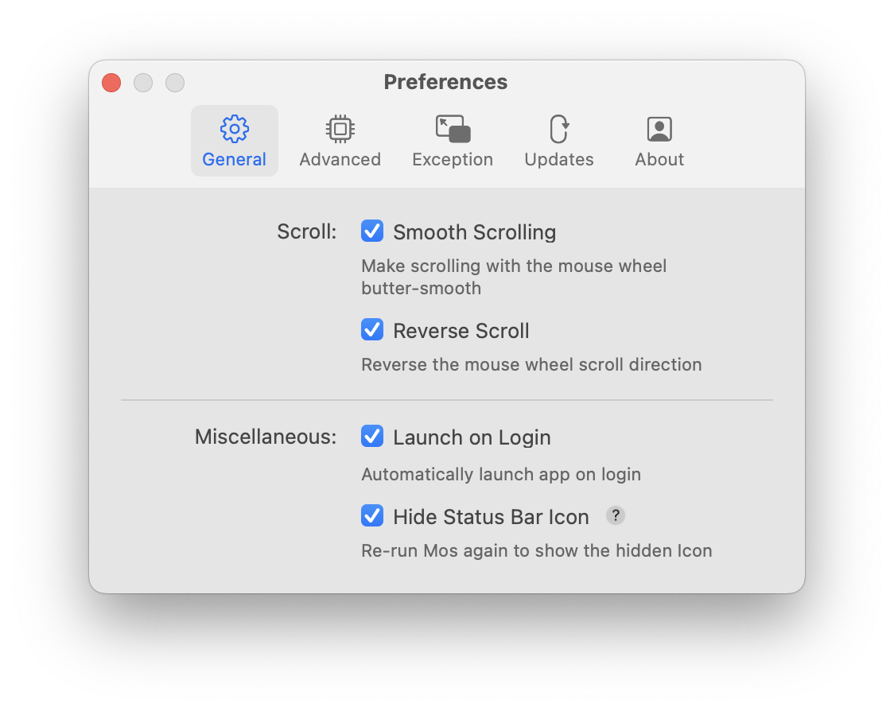
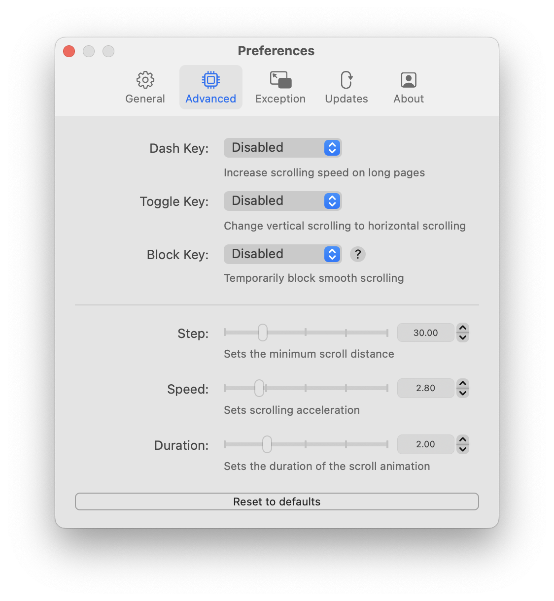

基于个人习惯和喜好梳理的MacOS系统基础配(到好用为)置
For macOS Ventura 13.2 & Apple Silicon
<!--more-->

***

## 命令行设定
### 显示隐藏文件
**推荐** 对于开发而言显示隐藏文件是必须的
```
defaults write com.apple.finder AppleShowAllFiles -boolean true
```
```
killall Finder # 重启Finder
```

### 调整鼠标变速
**推荐** Mac的触摸板有多舒服，鼠标就有多难受。究其根本是因为macOS中pointer的加速曲线是为触摸板调校的，而鼠标调用同样的加速曲线会有种无法立即停止的延迟感。可以单独禁用鼠标设备的scaling
```
defaults read .GlobalPreferences com.apple.mouse.scaling # 读取当前scaling
```
```
defaults write .GlobalPreferences com.apple.mouse.scaling -1 # 禁用
```

### 禁用翻盖开机
**推荐** 有时候想关机了清洁一下键盘，翻开盖子直接DUANG也会有点不方便
```
sudo nvram AutoBoot=%00 # 禁用
```
```
sudo nvram AutoBoot=%03 # 恢复
```

### IPv6解析
**选用** 仅在需要时使用
```
networksetup -setv6off Wi-Fi # 关闭
```
```
networksetup -setv6automatic Wi-Fi # 恢复auto
```

### 磁盘工具Debug菜单
**选用** 仅在需要时使用
```
defaults write com.apple.DiskUtility DUDebugMenuEnabled 1
```
重启“磁盘工具”，菜单栏里会多出一项“调试”菜单，选中此菜单中的“显示所有分区”菜单项，就会在左侧显示出磁盘的隐藏分区。

***

## 系统&APP设定
### Finder
**推荐** 尽可能展示有用信息
1. *Settings* - *Advanced* - ✅ *Show all filename extensions*
2. *View* - ✅ *Show Path Bar*
3. *View* - ✅ *Show Status Bar*

### Dictionary
**推荐** 很多人忽视的系统级功能，在任意界面任意文本词汇上重压触摸板是可以触发词典功能的。在系统语言为美语、简体中文的情况下系统默认开启了许多词典，在此仅选用牛津英汉词典已可以满足日常单词查阅需求了。
*Settings* - ✅ *牛津英汉汉英词典*

### Alfred 5
**推荐** [官网](https://www.alfredapp.com/)
Spotlight高替，比较坑的是5开始导出/导入备份的profile变成收费功能了，暂时还没去折腾怎么自己实现
1. 先上常规配置 *General*
    - ✅ *Launch Alfred at login* 开机启动
    - 热键建议使用`Command+Space`，完全替代原系统自带Spotligh，注意在系统设置中关闭Spotlight快捷键防止冲突
2. 在 *Feature* - *Default Results* 中设置搜索结果包含的内容和范围
2. 在 *Feature* - *File Search* 中设置激活各项搜索功能的keywords
3. 在 *Feature* - *Web Search* - 🌟 *Add Custom Search* 添加自定义快捷网络搜索。配置完成后先`Command+Space`激活，再输入 *keyword {query}* ，如 *bing Hexo* 即可直接打开bing搜索关键词Hexo
    
    #### Title: Search Bing for {query}
    **Keyword: bing**
    ```
    https://cn.bing.com/search?q={query} # Search URL
    ```
    
    只要是带query的url都能自定义，因此也可以用来翻译
    
    #### Translate {query} from English to Chinese
    **tl**
    ```
    https://cn.bing.com/translator?ref=TThis&text={query}&from=en&to=zh-Hans
    ```
    
    
    #### Translate {query} from Chinese to English
    **tlc**
    ```
    https://cn.bing.com/translator?ref=TThis&text={query}&from=zh-Hans&to=en
    ```
    

<!-- - amz - https://www.amazon.com/s?k={query} - Search Amazon for {query}
- bing - https://cn.bing.com/search?q={query} - Search Bing for {query}
- bl - https://search.bilibili.com/all?keyword={query}&from_source=webtop_search - Search Bilibili for {query}
- tb - https://s.taobao.com/search?q={query}&commend=all - Search Taobao for {query}
- zh - https://www.zhihu.com/search?type=content&q={query} - Search Zhihu for {query}
- tl - https://cn.bing.com/translator?ref=TThis&text={query}&from=en&to=zh-Hans - Translate {query} in English into Chinese
- tlc - https://cn.bing.com/translator?ref=TThis&text={query}&from=zh-Hans&to=en - Translate {query} in Chinese into English -->

### Contexts
**推荐** [官网](https://contexts.co/)
Contexts可以实现通过快捷键切换窗口，包括同一应用的不同窗口。目前阶段依然比Ventura的台前调度好用。重点配置 *Command-Tab* 项中切换窗口的组合键(习惯使用 `Command+Tab` 激活切换)，注意勾选 *Show windows from: All Spaces* (在所有显示器的窗口间切换)和 *Show windows of: All apps* (在所有应用的窗口间切换)。注意 *Search* 项中的默认组合键 `^+Space` 可能与其他应用冲突，建议取消勾选
<!--  -->
<div style="width:70%;margin:auto">

</div>
切换效果如图
<!--  -->
<div style="width:70%;margin:auto">

</div>


### Mos
**推荐** [Github](https://github.com/Caldis/Mos)
一个用于在MacOS上平滑鼠标滚动效果的小工具, 填平mac鼠标控制的坑，让滚轮爽如触控板。注个人设置如下，注意最好关闭系统和其他第三方鼠标工具(如Logi Options)中的 *Smooth Scrolling* ，并设置 *Scroll Diraction* 为 *Natural* ，以防冲突
<!-- 
 -->
<div style="width:70%;margin:auto">


</div>

### Logi Options+
**选用** [下载](https://www.logitech.com/en-sg/software/logi-options-plus.html#software-download)
MX Master yyds，鼠标键位配置后非常适合mac使用。如下设置后可以大部分替代触摸板手势，解放手腕。注意如果配合Mos使用的话关闭 *Smooth scrolling* ，并设置 *Scoll direction* 为 *Natural* 

<!-- 
 -->



<!-- 
 -->
